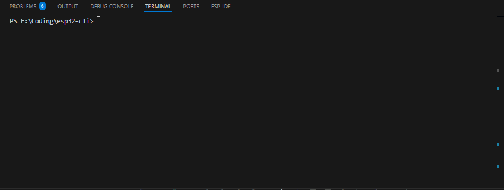

# ESP32 CLI



Simple CLI tool to communicate with an ESP32 via custom commands

# About The Project
A bare-metal CLI for ESP32, all written in **Pure C** while using the **ESP-IDF** Framework.

Arduino-based projects tend to rely on blocking the `Serial.read()` functions, while in this project we are making a **non-blocking UART driver** with custom ring buffer and a command parser.
It demonstrates how to handle raw byte streams, manage memory manually and control hardware registers without higher-level abstractions.

## Tech Usage
* **Language:** C (C99 Standard)
* **SDK:** Espressif IoT Development Framework (ESP-IDF v5.1)
* **Build System:** CMake & Ninja
* **Hardware:** ESP32-WROOM-32 (DevKit V1)

## Features
* **Non-Blocking I/O:** Uses FreeRTOS task notifications and UART interrupts to process input without freezing the CPU.
* **Custom Command Parser:** Tokenizes input strings to separate commands from arguments (e.g., `led on`).
* **Line Buffering:** Implements a character buffer with Backspace support and Enter-key detection.
* **Hardware Control:** Direct GPIO manipulation to toggle onboard LEDs.
* **Crash Resistant:** Handles buffer overflows and invalid commands gracefully.

## Hardware Setup
* **Controller:** ESP32 Development Board.
* **Connection:** Micro-USB Or Type C data cable connected to the UART0 port.
* **Pinout:**
    * **Built-in LED:** GPIO 2 (Active High).

# Getting Started

## Prerequisites
* VS Code with [Espressif IDF Extension](https://github.com/espressif/vscode-esp-idf-extension).
* Git & Python 3.11+.

## Build And Flash
1.  **Clone the repo:**
    ```bash
    git clone https://github.com/abduznik/esp32-uart-cli.git
    ```
2.  **Build the project:**
    Click the **Build** icon in VS Code or run:
    ```bash
    idf.py build
    ```
3.  **Flash to ESP32:**
    Hold the `BOOT` button on your board and click **Flash**, or run:
    ```bash
    idf.py -p COMX flash monitor
    ```

# Usage
Open the Serial Monitor. 
Type `help` to see the menu.

| Command | Description |
| :--- | :--- |
| `help` | Displays the list of available commands. |
| `ping` | Returns "pong!" to verify connection. |
| `led on` | Turns the onboard Blue LED ON. |
| `led off` | Turns the onboard Blue LED OFF. |
| `clear` | Clears the terminal screen. |
| `gpio status` | Lists all safety ratings, levels, and colors. |
| `gpio read <pin>` | Safely reads logical level of any exposed pin. |
| `gpio set <pin> <0/1>` | Safely sets output level of general/strapping pins. |
| `adc status` | Lists all 12-bit analog input levels and mV calculations. |
| `adc read <pin>` | Performs on-demand analog read conversion. |

---

## 📚 Documentation & Architecture

For in-depth guides on the new safety protections and modular software structure, explore:
* **[Modular Software Architecture](docs/architecture.md)** — Breakdown of decoupled hardware drivers, wrapper libraries, and code de-duplication results.
* **[Hardware Safety & Control Manual](docs/gpio_safety_implementation.md)** — Comprehensive breakdown of ESP32 strapping pins, blocked critical registers (SPI Flash/Console UART), ADC attenuation math, and host-side testing instructions.
* **[Safety-Aware Dynamic I2C Controller](docs/i2c_implementation.md)** — Dynamic I2C scanner address matrix grids, dynamic SDA/SCL remapping validations, and raw register read/writes.